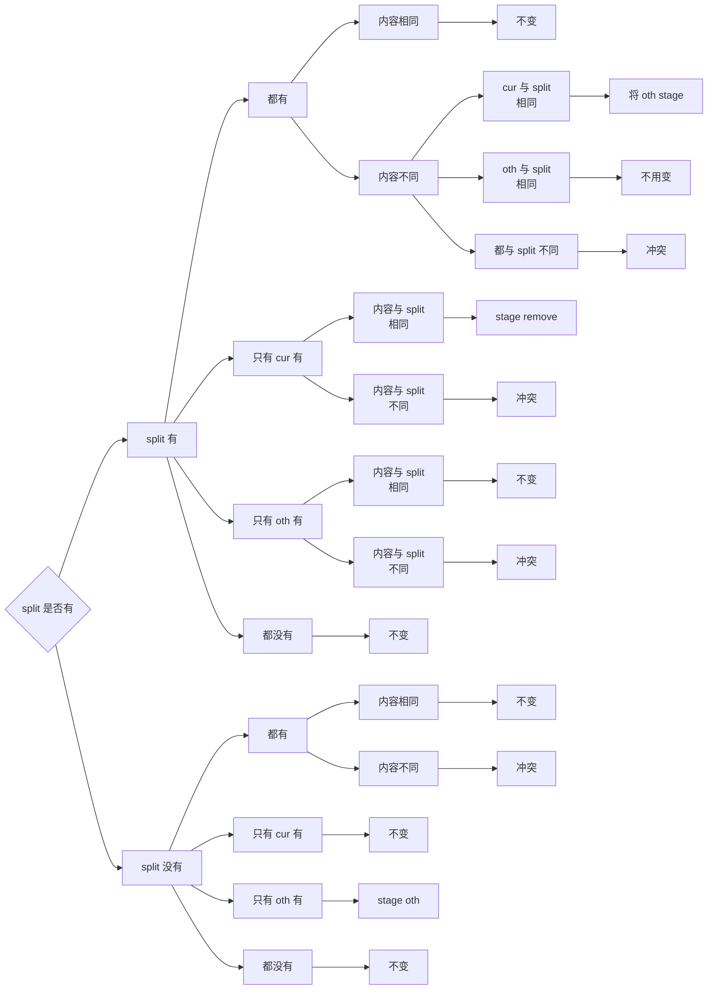

# CS61B-sp21 Project2: Gitlet

---

## 项目介绍

Gitlet 是基于 JAVA 实现的**版本控制系统(Version Control System)**，其灵感来源于工业中使用的 Git。Gitlet 支持包括**版本控制，分支管理，远程仓库**等最基本的 Git 命令，实现了文件副本的本地持久化存储，能够很好地帮助开发者完成版本控制工作。

---

## 环境搭建

本项目使用 JDK 15+，依托于 CS61B sp21 的课程环境实现，需要严格按照以下步骤配置环境：

首先获取官方代码框架并切换至对应目录

```bash
git clone https://github.com/Berkeley-CS61B/skeleton-sp21.git

cd skeleton-sp21
```

然后下载 Java 库，这样会拿到 `skeleton-sp21/library-sp21/javalib` 这个目录，里面是我们需要的 Java 库。

```bash
git submodule update --init
```

然后再克隆本仓库到 `skeleton-sp21` 目录下

```bash
git clone https://github.com/AL-Shoukaku/CS61B-Gitlet
```

然后用 IntelliJ IDEA 作为项目打开 `CS61B-Gitlet/pom.xml`，点击 `设置 -> 构建、执行、部署 -> 构建工具 -> Maven`，将**本地仓库**设置为刚刚的 `skeleton-sp21/library-sp21/javalib` 目录，然后重新加载 Maven 即可完成环境配置。


---

## 快速开始

在`CS61B-Gitlet`目录下执行以下名来来编译源代码。

```bash
make
```

然后使用以下格式进行版本管理，需将`cmd`替换为**核心功能**中介绍的指令

```bash
java gitlet.Main <cmd>
```

使用以下命令可以清楚编译出来的`*.class`文件

```bash
make clean
```

---

## 项目架构

### 整体结构

```
CS61B-Gitlet/
├── guide/
│   ├── Blob.java       # 代表一个文件的副本
│   ├── Branch.java     # 代表一个分支
│   ├── Commit.java     # 代表一个提交
│   ├── Gitlet.java     # 用于实现所有指令的核心逻辑
│   ├── Head.java       # 代表Head指针
│   ├── Main.java       # 程序入口
│   ├── Repository.java # 代表一个仓库,封装仓库操作
│   ├── Stage.java      # 代表暂存区
│   └── Utils.java      # 工具类,封装一些 java 的文件操作
├── guidebook-cn/       # 使用 AI 翻译的中文指导书
├── testing/            # 测试用例
├── Makefile            # 编译源代码的 Makefile
└── README.md           # 项目说明文档
```

### .gitlet 仓库结构

```
.gitlet/
├── blobs/     # 存储文件副本的目录
├── branches/  # 存储分支信息的目录
├── commits/   # 存储提交信息的目录
├── heads      # 存储 Head 指针的文件
└── stage      # 存储暂存区信息的文件
```

---

## 核心功能

### init

#### 使用方法

```bash
java gitlet.Main init
```

#### 功能描述

初始化一个 Gitlet 仓库，创建 `.gitlet` 目录，并自动进行一次空的 commit，其 message 为 `initial commit`,时间戳为`00:00:00 UTC, Thursday, 1 January 1970`。初始分支为 `master`，并且 `HEAD` 指向 `master` 分支。

如果 `.gitlet` 目录已经存在，则输出 `A Gitlet version-control system already exists in thecurrent directory.`

### add

#### 使用方法

```bash
java gitlet.Main add <filename>
```

- `filename`：需要 add 的文件名

#### 功能描述

将指定文件加入到暂存区中，一次一个，若文件不存在则输出`File does not exist.`.

`add` 会重写暂存区的内容，如果`add`写入后和当前 commit 中的内容一致，则取消其暂存状态。

如果文件在暂存区中处于`remove`状态，则会取消该状态并将其加入暂存区。

### commit

#### 使用方法

```bash
java gitlet.Main commit <message>
```

- `message`：commit 的信息

#### 功能描述

执行一次提交(commit)操作，将暂存区的内容保存到仓库中并清空暂存区；生成一个新的 commit 对象，将 head 和当前分支指向该 commit，之前的 commit 为该 commit 的 parent。

commit 的信息为 message,如果想传入多个单词需要加引号，commit 的时间戳为当前时间。

如果暂存区为空，则输出`No changes added to the commit.`.如果 message 为空，则输出`Please enter a commit message.`

commit 的 id 为 commit 对象的 SHA-1 值，将 commit 对象序列化后存储在 `.gitlet/commits` 目录下，文件名为 commit 的 id。

### rm

#### 使用方法

```bash
java gitlet.Main rm <filename>
```

- `filename`：需要 remove 的文件名

#### 功能描述

如果文件在暂存区中，则将其从暂存区中删除。如果文件在当前 commit 中，则将其标记为 remove 状态，并从工作区中删除该文件。

如果文件既不在暂存区中也不在当前 commit 中，则输出`No reason to remove the file.`

### log

#### 使用方法

```bash
java gitlet.Main log
```

#### 功能描述

会从当前 head 指向的 commit 开始，沿着 firstParent 指针一直向上遍历，按照如下格式输出每一个commit的信息，直到遍历到初始 commit 为止。

```bash
===
commit 3e8bf1d794ca2e9ef8a4007275acf3751c7170ff
Date: Thu Nov 9 17:01:33 2017 -0800
Another commit message.

===
commit e881c9575d180a215d1a636545b8fd9abfb1d2bb
Date: Wed Dec 31 16:00:00 1969 -0800
initial commit
```

信息包括 commit 的 SHA-1 值，commit 的时间戳，commit 的 message。

如果该 commit 来自于 merge，则会输出两个 parent 的 SHA-1 值的前 7 位：

```bash
===
commit 3e8bf1d794ca2e9ef8a4007275acf3751c7170ff
Merge: 4975af1 2c1ead1
Date: Sat Nov 11 12:30:00 2017 -0800
Merged development into master.
```

### global-log

#### 使用方法

```bash
java gitlet.Main global-log
```

#### 功能描述

会直接输出所有 commit 的信息，没有指定顺序，格式和 log 一样。

### find

#### 使用方法

```bash
java gitlet.Main find <message>
```

- `message`：需要查找的 commit message

#### 功能描述

查找包含指定 message 的 commit，并输出其 SHA-1 值，支持查找多个这样的 commit。如果没有找到，则输出`Found no commit with that message.`

### status

#### 使用方法

```bash
java gitlet.Main status
```

#### 功能描述

查询当前 Gitlet 仓库的状态，输出当前分支信息，暂存区信息，remove 状态文件信息，未跟踪文件信息，以下是一个示例：

```bash
=== Branches ===
*master
other-branch
  
=== Staged Files ===
wug.txt
wug2.txt
  
=== Removed Files ===
goodbye.txt
  
=== Modifications Not Staged For Commit ===
junk.txt (deleted)
wug3.txt (modified)
  
=== Untracked Files ===
random.stuff
```

### checkout

#### 使用方法

checkout 根据参数的不同有三种使用方法：

```bash
java gitlet.Main checkout -- [file name]

java gitlet.Main checkout [commit id] -- [file name]

java gitlet.Main checkout [branch name]
```

#### 功能描述

1. `checkout -- [file name]`
将当前 commit 中的指定文件恢复到工作区中，如果该文件在当前 commit 中不存在，则输出`File does not exist in that commit.`
2. `checkout [commit id] -- [file name]`
将指定 commit id 对应的 commit 中的指定文件恢复到工作区中，如果该 commit 不存在，则输出`No commit with that id exists.`，如果该文件在指定 commit 中不存在，则输出`File does not exist in that commit.`
3. `checkout [branch name]`
将 head 指针指向指定分支，并将工作区恢复到该分支的最新 commit 的状态，清空暂存区。如果该分支不存在，则输出`No such branch exists.`，如果该分支就是当前分支，则输出`No need to checkout the current branch.`，如果切换分支会导致工作区中未跟踪文件被覆盖，则输出`There is an untracked file in the way; delete it, or add and commit it first.`

### branch

#### 使用方法

```bash
java gitlet.Main branch <branch name>
```

- `branch name`：需要创建的分支名

#### 功能描述

创建一个新的分支，指向当前 commit，分支名为`branch name`，如果该分支已经存在，则输出`A branch with that name already exists.`。该命令不会修改 head 指针。

### branch-rm

#### 使用方法

```bash
java gitlet.Main branch-rm <branch name>
```

- `branch name`：需要删除的分支名

#### 功能描述

删除指定的分支，如果该分支不存在，则输出`A branch with that name does not exist.`，如果该分支就是当前分支，则输出`Cannot remove the current branch.`

### reset

#### 使用方法

```bash
java gitlet.Main reset <commit id>
```

- `commit id`：需要重置到的 commit id

#### 功能描述

将指定 commit id 对应的 commit 中的所有文件恢复到当前工作区中，删除在当前 commit 但不在指定 commit 中的文件，并将 head 指针和当前分支指向该 commit。如果该 commit 不存在，则输出`No commit with that id exists.`，如果重置会导致工作区中未跟踪文件被覆盖，则输出`There is an untracked file in the way; delete it, or add and commit it first.`

### merge

#### 使用方法

```bash
java gitlet.Main merge <branch name>
```

- `branch name`：需要合并的分支名

#### 功能描述

将指定分支合并到当前分支，会创建一个新的 commit，其 firstParent 为当前 commit，secondParent 为给定 commit，message 为`Merged <branch name> into <current branch name>.`。

分支合并时的处理原则如下：



如果该分支不存在，则输出`A branch with that name does not exist.`，如果该分支就是当前分支，则输出`Cannot merge a branch with itself.`，如果合并会导致工作区中未跟踪文件被覆盖，则输出`There is an untracked file in the way; delete it, or add and commit it first.`

---

## 参考资料

- [CS61B-sp21 课程网站](https://sp21.datastructur.es/)
- [Project2 官方文档](https://sp21.datastructur.es/materials/proj/proj2/proj2)
