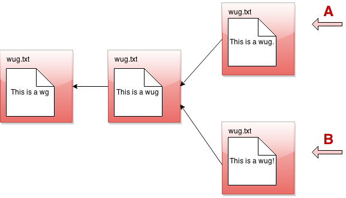
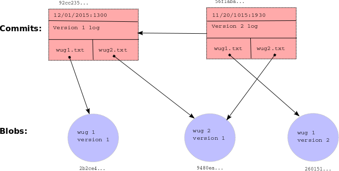
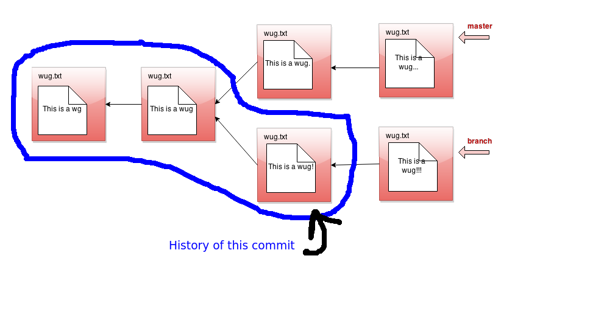
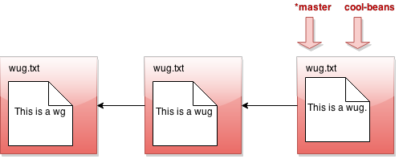
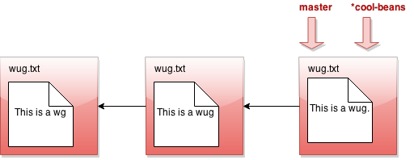
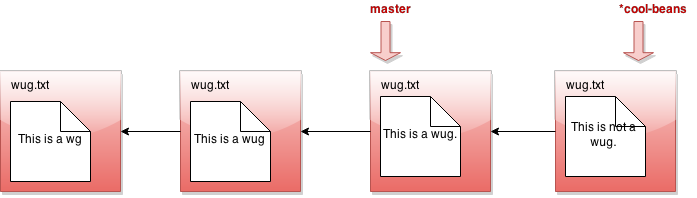
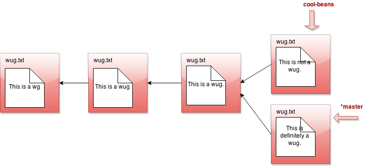
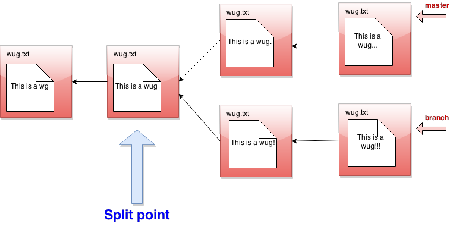

# 项目 2：Gitlet

---

## 关于本规格说明的一点说明

这份规格说明（spec）相当长。前半部分会非常详细地描述你需要支持的每一个命令，后半部分则包含测试细节以及一些建议。为了帮助你消化这些内容，课程准备了许多高质量视频，用来讲解规格说明的不同部分，并给出如何开始、从哪里开始的建议。所有视频都会在规格说明中的相关位置给出链接，不过为了方便，也会在这里集中列出。注意：其中一些视频是在 2020 年春季制作的，当时 Gitlet 是 Project 3，Capers 是 Lab 12；有些视频还会短暂提到 Hilfinger 教授的 CS 61B 配置（包括名为 `shared` 的 remote、名为 `repo` 的仓库等）。这些内容请忽略，因为它们对你本学期没有有用信息。作业的实际内容没有变化。

随着更多资源被创建，我们会把它们添加到这里，所以请经常刷新！

---

## Gitlet 概览

**警告：** 在开始本项目之前，请确保你已经完成 Lab 6: Canine Capers。Lab 6 旨在作为本项目的引入，会非常有助于你入门并确认环境已经配置好。你也应该已经看过 Lecture 12: Gitlet，这节课介绍了本项目中许多有用的想法。

在这个项目中，你将实现一个**版本控制系统（version-control system）**，它会模仿流行系统 Git 的一些基本功能。不过我们的系统更小、更简单，所以命名为 Gitlet。

版本控制系统本质上是一个面向相关文件集合的备份系统。Gitlet 支持的主要功能包括：

1. 保存整个目录中文件的内容。在 Gitlet 中，这叫作 committing，保存下来的内容本身叫作 commits。
2. 恢复一个或多个文件的某个版本，或者恢复整个 commit。在 Gitlet 中，这叫作 checking out 这些文件或这个 commit。
3. 查看备份历史。在 Gitlet 中，你会在称为 log 的东西里查看这段历史。
4. 维护相关的 commit 序列，称为 branches。
5. 将一个 branch 中做出的修改合并（merge）到另一个 branch。

版本控制系统的意义在于，当你创建复杂项目（甚至是不那么复杂的项目），或者与他人协作开发项目时，它能帮助你。你会周期性地保存项目版本。如果之后某个时刻你不小心把代码弄坏了，就可以把源码恢复到之前 commit 过的版本（同时不丢失那之后你做出的修改）。如果你的协作者在某个 commit 中做出了修改，你可以把这些修改合入（merge）到你自己的版本中。

在 Gitlet 中，你不是一次只 commit 单个文件。相反，你可以一次 commit 一组语义上连贯的文件。我们喜欢把每个 commit 看作你的整个项目在某个时间点上的**快照（snapshot）**。不过为了简单起见，本文档后面的许多例子一次只涉及一个文件的变化。只要记住：每次 commit 都可以修改多个文件。

在这个项目中，把我们随时间创建的 commits 可视化会很有帮助。假设我们有一个只包含文件 `wug.txt` 的项目，我们给它添加一些文本并 commit。然后修改这个文件并 commit 这些变化。然后再次修改这个文件，并再次 commit。现在我们一共保存了这个文件的三个版本，每个版本都比前一个版本更晚。我们可以把这些 commits 可视化。


这里画出的箭头表示每个 commit 都包含某种对前一个 commit 的引用。我们把前一个 commit 称为**父提交（parent commit）**，这在后面会很重要。但目前来看，这张图是不是很眼熟？没错，它就是一个链表！

Gitlet 背后的核心想法是：我们可以把文件不同版本的历史看成这样的一个列表。这样一来，恢复旧版本文件就很容易。你可以想象有一个命令：“Gitlet，请恢复到 commit #2 时的文件状态”，Gitlet 就会到链表中的第二个节点，恢复那里保存的文件副本，同时删除那些存在于第一个节点但不存在于第二个节点的文件。

如果我们告诉 Gitlet 恢复到某个旧 commit，链表的最前端就不再反映当前文件状态，这可能有些误导。为了解决这个问题，我们引入一种叫作**头指针（head pointer，也叫 HEAD pointer）**的东西。头指针记录我们当前位于链表的哪里。通常，当我们创建 commits 时，头指针会停留在链表最前端，表示最新 commit 反映了当前文件状态。


不过，假设我们恢复到 commit #2 时的文件状态（严格说，这就是你稍后会在规格说明中看到的 `reset` 命令）。我们会把头指针移回去来表示这一点。


这里我们说自己处于**分离头指针状态（detached HEAD state）**，你以前可能也遇到过。它的含义就是这样！

**2021-03-05 编辑：** 注意，在 Gitlet 中不存在 detached HEAD state，因为没有一个 `checkout` 命令会把 HEAD 指针移动到某个特定 commit。`reset` 命令会这么做，但它同时也会移动 branch pointer。因此，在 Gitlet 中，你永远不会处于 detached HEAD state。



好了，如果 Gitlet 只能做到这些，那它会是一个非常简单的系统。但 Gitlet 还有一个本事：它不仅能维护文件的新旧版本，还能维护相互分化的版本。想象你正在写一个项目，并且有两种推进思路：我们称它们为 Plan A 和 Plan B。Gitlet 允许你保存这两个版本，并随意在它们之间切换。


这已经不再像链表了，更像是一棵树。我们把它称为 **commit tree（提交树）**。沿用这个比喻，每个独立版本都称为树上的一个 **branch（分支）**。你可以分别开发每个版本。

树中有两个指针，表示每个 branch 的最前端。在任意时刻，只有其中一个是当前活跃指针，这就是所谓的 head pointer。head pointer 是当前 branch 最前端的指针。

这就是我们对 Gitlet 系统的简要概览！如果你还没有完全理解，不用担心；上面这一节只是为了给你一个高层次图景，让你知道它大体应该做什么。下一节开始会给出这个项目的详细规格说明。

最后再说一句：**commit tree 是不可变的（immutable）**。一旦某个 commit 节点被创建，它就永远不能被销毁（也完全不能被修改）。我们只能向 commit tree 中添加新东西，不能修改已有东西。这是 Gitlet 的一个重要特性！Gitlet 的目标之一就是让我们保存东西，这样就不会不小心删除它们。

---

## 内部结构

真正的 Git 区分几种不同类型的对象。对我们来说，重要的是：

- **blobs：** 文件内容的保存副本。由于 Gitlet 会保存文件的许多版本，一个文件可能对应多个 blobs：每个 blob 在不同 commit 中被跟踪（tracked）。
- **trees：** 目录结构，将名字映射到 blobs 和其他 trees（子目录）的引用。
- **commits：** 由日志消息（log message）、其他元数据（commit 日期、作者等）、对 tree 的引用、以及对父 commits 的引用组合而成。仓库还会维护从 branch heads 到 commits 引用的映射，让某些重要 commits 拥有符号名称。

Gitlet 相比 Git 进一步简化：

- 将 trees 合并进 commits，并且不处理子目录（所以每个仓库会有一个“扁平”的普通文件目录）。
- 只允许引用两个 parents 的 merge（真正的 Git 中可以有任意数量的 parents）。
- 元数据只包含时间戳和日志消息。因此，一个 commit 将包含日志消息、时间戳、文件名到 blob 引用的映射、一个 parent 引用，以及（对于 merge）第二个 parent 引用。

每个对象，也就是在我们的实现中每个 blob 和每个 commit，都有一个唯一的整数 id，用来作为该对象的引用。Git 的一个有趣特性是这些 id 是通用的：不同于典型的 Java 实现，两个内容完全相同的对象在所有系统上都会拥有相同 id（也就是说，我的电脑、你的电脑、其他任何人的电脑都会计算出完全相同的 id）。对于 blobs，“相同内容”表示相同的文件内容。对于 commits，它表示相同元数据、相同的名字到引用的映射，以及相同的 parent 引用。因此，仓库中的对象被称为**内容寻址（content addressable）**。

Git 和 Gitlet 都通过同一种方式实现这一点：使用名为 **SHA-1（Secure Hash 1）** 的密码学哈希函数，它能从任意字节序列产生一个 160 位整数哈希。密码学哈希函数具有这样的性质：找到两个不同字节流却拥有相同哈希值是极其困难的（甚至仅凭哈希值找到任意一个对应字节流也极其困难）。所以本质上，我们可以假设任意两个不同内容的对象拥有相同 SHA-1 哈希值的概率是 2<sup>-160</sup>，约为 10<sup>-48</sup>。基本上，我们会直接忽略哈希碰撞的可能性。因此这个系统原则上存在一个根本性 bug，但实践中它永远不会发生！

幸运的是，有库类可以计算 SHA-1 值，所以你不需要处理实际算法。你要做的只是确保正确标记所有对象。具体来说，这包括：

- 在对 commit 进行哈希时包含所有元数据和引用。
- 用某种方式区分 commits 的哈希和 blobs 的哈希。一种好方法是在 `.gitlet` 目录内部设计清晰的目录结构。另一种方法是在每个对象参与哈希时额外加入一个单词，对 blobs 取一个值，对 commits 取另一个值。

顺便说一句，将 SHA-1 哈希值渲染成 40 字符十六进制字符串，会成为在 `.gitlet` 目录中存储数据时很方便的文件名（下面会详细说明）。它也给你提供了一种比较两个文件（blobs）内容是否相同的便捷方式：如果它们的 SHA-1 相同，我们就直接假设这些文件相同。

对于 remotes（比如我们整个学期都在用的 `skeleton`），我们会简单使用其他 Gitlet 仓库。Pushing 的含义只是把 remote 仓库还没有的所有 commits 和 blobs 复制到 remote 仓库，并重置一个 branch 引用。Pulling 做的是同样的事，只是方向相反。Remotes 是本项目的额外加分内容，不是拿满基础分的要求。

借助 Java 的序列化设施，把内部对象从文件中读出、写入文件其实很容易。接口 `java.io.Serializable` 没有任何方法，但如果一个类实现了它，Java 运行时就会自动提供一种方法，将对象转换为字节流，也可以从字节流转换回来。你可以用 I/O 类 `java.io.ObjectOutputStream` 把字节流写入文件，再用 `java.io.ObjectInputStream` 读回并反序列化（deserialize）。术语“serialization（序列化）”指的是将某种任意结构（数组、树、图等）转换为一串连续字节。你应该已经在 lab 6 中见过并练习过序列化。这里会使用非常类似的方法，所以在处理持久化（persistence）和序列化时，请把 lab 6 当作资源使用。

下面是本节讨论结构的一个总结性例子。可以看到，每个 commit（矩形）都指向一些 blobs（圆形），这些 blobs 包含文件内容。commits 包含文件名和对这些 blobs 的引用，也包含一个 parent link。这些引用在图中表示为箭头，在 `.gitlet` 目录中用它们的 SHA-1 哈希值表示（commits 上方和 blobs 下方的小十六进制数字）。较新的 commit 包含 `wug1.txt` 的更新版本，但与较旧 commit 共享同一版本的 `wug2.txt`。你的 commit 类需要以某种方式存储图中展示的所有信息：谨慎选择内部数据结构会让实现变得更容易或更困难，所以你很有必要花时间规划和思考存储所有内容的最佳方式。



---

## 行为详细规格

#### 总体规格

我们对结构唯一的硬性要求是：你必须有一个名为 `gitlet.Main` 的类，并且它有一个 main 方法。

我们还提供了一些工具方法，用来执行许多主要与文件系统相关的任务，这样你就可以专注于项目逻辑，而不是处理操作系统细节。

我们还添加了两个建议类：`Commit` 和 `Repository`，帮助你开始。当然，你可以编写额外的 Java 类来支持项目，也可以删除我们建议的类。但不要使用任何外部代码（JUnit 除外），也不要使用 Java 以外的任何编程语言。你可以任意使用 Java 标准库，以及我们提供的工具。

你不应该把所有事情都放在 Main 类里。你的 Main 类主要应该调用 `Repository` 类中的 helper methods。结构示例可以参考 lab 6 中的 `CapersRepository` 和 `Main` 类。

这份规格说明的大部分会描述 `Gitlet.java` 的 main 方法在接收到各种 gitlet 命令作为命令行参数时必须如何反应。但在按命令逐一拆解之前，先给出整个项目都应满足的一些总体指导原则：

- 为了让 Gitlet 工作，它需要一个地方存储旧文件副本和其他元数据。所有这些东西都必须存储在一个名为 `.gitlet` 的目录中，就像真正的 git 系统把这些信息存储在 `.git` 目录中一样（名字前面有 `.` 的文件是隐藏文件。在大多数操作系统上默认看不到它们。在 Unix 中，命令 `ls -a` 会显示它们）。如果某个位置有 `.gitlet` 目录，我们就认为该位置中的 Gitlet 系统已经“初始化（initialized）”。大多数 Gitlet 命令（除了 `init` 命令）只需要在已经初始化 Gitlet 系统的目录中工作，也就是包含 `.gitlet` 目录的目录。不在 `.gitlet` 目录里的文件（它们是你正在使用和编辑的仓库文件副本，以及你打算加入仓库的文件）称为**工作目录（working directory）**中的文件。
- 大多数命令都有运行时间或内存使用要求。你必须遵守这些要求。有些运行时间被描述为“相对于任何重要度量都是常数”。重要度量包括：文件数量或文件大小的任何度量，commit 数量的任何度量。你可以忽略序列化或反序列化所需时间，但有一个前提：你的序列化时间不能以任何方式依赖于已经 add、commit 等操作过的文件总大小（什么是 serialization？如果不知道，请回顾 Lab 6）。你也可以假设从哈希表中获取数据是常数时间。
- 有些命令具有指定错误消息的失败情况。后面的规格说明会给出这些错误消息的精确格式。所有错误消息都以句号结尾；因为自动评分是逐字比较，请务必包含句号。如果程序遇到这些失败情况之一，它必须打印错误消息，并且不能做任何其他修改。除了列出的失败情况，你不需要处理其他错误情况。
- 有一些失败情况不属于某个特定命令，但你仍然需要处理：

  - 如果用户没有输入任何参数，打印消息 `Please enter a command.` 然后退出。
  - 如果用户输入了不存在的命令，打印消息 `No command with that name exists.` 然后退出。
  - 如果用户输入命令时 operands（操作数）的数量或格式错误，打印消息 `Incorrect operands.` 然后退出。
  - 如果用户输入的命令要求位于已初始化的 Gitlet 工作目录中（即包含 `.gitlet` 子目录），但当前并不在这样的目录中，打印消息：

```plaintext
Not in an initializedGitlet directory.
```

- 有些命令会列出它们与真正 Git 的差异。规格说明并不会穷尽列出所有差异，但会列出一些更大、更容易令人困惑或误导的差异。
- **除了规格说明要求输出的内容，不要打印任何东西。** 如果你打印了不必要的内容，我们的一些自动评分测试会失败。
- 要立即退出程序，你可以调用 `System.exit(0)`。例如，如果 helper function 中间发生错误，而你想让 gitlet 立刻终止，就可以调用这个函数。注意：你应该始终给 `System.exit(0)` 传入参数 0。在 61C 中，你会学习这个参数（称为错误码 error code）的含义。
- 规格说明会把一些命令归类为“危险（dangerous）”。危险命令是那些可能覆盖文件（不只是元数据）的命令。例如，如果用户告诉 Gitlet 把文件恢复到旧版本，Gitlet 可能会覆盖文件当前版本。仅供参考，所以测试这些命令前请戴好头盔 :)

## 命令

现在我们详细讲解你必须支持的每个命令。记住，优秀程序员总是关心数据结构：阅读这些命令时，你应该首先思考如何存储数据，才能轻松支持这些命令；其次思考有没有机会复用已经实现的命令（提示：在 Project 2 后半部分，有大量机会复用 Project 2 前半部分已经写过的代码）。我们在一些方法下列出了觉得有用的课程，但你不必一定使用这些课程中的概念。有些容易混淆的命令配有概念小测，你绝对应该用它们检查自己的理解。这些小测不计分，只是帮助你在尝试实现命令之前确认理解。

#### init

- **用法：** `java gitlet.Main init`
- **描述：** 在当前目录创建一个新的 Gitlet 版本控制系统。该系统会自动从一个 commit 开始：这个 commit 不包含任何文件，commit message 是 `initial commit`（就是这几个词，没有标点）。它会有一个 branch：`master`，最初指向这个 initial commit，并且 `master` 会是当前 branch。这个 initial commit 的时间戳是 UTC 时间 1970 年 1 月 1 日星期四 00:00:00，你可以用任意日期格式表示（这称为 “The (Unix) Epoch”，内部用时间 0 表示）。由于 Gitlet 创建的所有仓库中的 initial commit 内容完全相同，因此所有仓库都会自动共享这个 commit（它们都有相同 UID），并且所有仓库中的所有 commits 都会追溯到它。
- **运行时间：** 相对于任何重要度量都应为常数。
- **失败情况：** 如果当前目录中已经存在 Gitlet 版本控制系统，则应中止。它不应该用新系统覆盖已有系统。应打印错误消息：

```plaintext
A Gitlet version-control system already exists in thecurrent directory.
```

- **危险？** 否
- **参考行数：** 约 15 行

#### add

- **用法：** `java gitlet.Main add [file name]`
- **描述：** 将该文件当前存在的副本添加到暂存区（staging area；见 `commit` 命令描述）。因此，添加文件也称为 staging the file for addition（将文件暂存以便加入）。对一个已经 staged 的文件再次 staging，会用新内容覆盖暂存区中之前的条目。暂存区应该位于 `.gitlet` 中。如果当前工作版本的文件与当前 commit 中的版本完全相同，就不要把它暂存为待添加；如果它已经在暂存区，也要从暂存区移除（例如文件被修改、add，然后又改回原始版本时会发生这种情况）。如果该文件在执行命令时正被暂存为待移除（见 `gitlet rm`），它将不再处于待移除状态。
- **运行时间：** 最坏情况下，应相对于被添加文件的大小以及 $\mathrm{lg}N$ 线性运行，其中 $N$ 是该 commit 中的文件数量。
- **失败情况：** 如果文件不存在，打印错误消息 `File does not exist.` 并退出，不做任何修改。
- **危险？** 否
- **参考行数：** 约 20 行
- **与真实 git 的差异：** 真实 git 中可以一次 add 多个文件。Gitlet 中一次只能 add 一个文件。
- **建议课程：** Lecture 16（Sets, Maps, ADTs），Lecture 19（Hashing）

#### commit

- **用法：** `java gitlet.Main commit [message]`
- **描述：** 保存当前 commit 和暂存区中被跟踪文件（tracked files）的快照，以便之后恢复，从而创建一个新的 commit。这个 commit 被称为正在 tracking 它保存的文件。默认情况下，每个 commit 的文件快照会和它的 parent commit 的文件快照完全相同；它会原样保留文件版本，不会更新它们。只有当某个它正在 tracking 的文件在 commit 时已经被 staged for addition，这个 commit 才会更新该文件内容；此时新 commit 会包含暂存的文件版本，而不是从 parent 得到的版本。commit 会保存并开始 tracking 所有被 staged for addition、但 parent 没有 tracking 的文件。最后，由于 `rm` 命令（见下文）把文件 staged for removal，当前 commit 中 tracked 的文件可能在新 commit 中变为 untracked。

  底线是：**默认情况下，一个 commit 拥有和 parent 相同的文件内容。staged for addition 和 staged for removal 的文件才是本次 commit 的更新。** 当然，日期（很可能还有 message）也会与 parent 不同。

  关于 commit 的额外说明：

  - commit 之后会清空暂存区。
  - `commit` 命令绝不会 add、change 或 remove 工作目录中的文件（`.gitlet` 目录中的文件除外）。`rm` 命令会移除这些文件，同时将它们 staged for removal，使它们在一次 `commit` 后变为 untracked。
  - 在 staged for addition 或 staged for removal 之后对文件做的任何修改都会被 `commit` 命令忽略；`commit` 只修改 `.gitlet` 目录的内容。例如，如果你用 Unix 的 `rm` 命令（而不是 Gitlet 中同名命令）删除了一个 tracked file，这不会影响下一次 commit；下一次 commit 仍然会包含该文件（现在已经被删除）的版本。
  - `commit` 命令之后，新的 commit 会作为新节点加入 commit tree。
  - 刚创建的 commit 会成为“当前 commit”，head pointer 现在指向它。之前的 head commit 是这个 commit 的 parent commit。
  - 每个 commit 应该包含它被创建时的日期和时间。
  - 每个 commit 都有关联的 log message，用来描述这个 commit 中文件的变化。该消息由用户指定。整条消息应该只占传给 `main` 的 `args` 数组中的一个条目。要包含多个单词的消息，你必须把它们放在引号中。
  - 每个 commit 都由其 SHA-1 id 标识，这个 id 必须包含它的文件（blob）引用、parent 引用、log message 和 commit time。
- **运行时间：** 运行时间相对于 commit 数量的任何度量都应为常数。运行时间最差不能超过它 tracking 的文件总大小的线性时间。另外，这个命令还有内存要求：commit 操作使 `.gitlet` 目录增加的大小不得超过 commit 时 staged for addition 的文件总大小，不包括额外元数据。这意味着不要存储那些 commit 从 parent 继承来的文件版本的冗余副本（提示：记住 blobs 是 content addressable 的，并利用 SHA1）。你可以保存文件的完整额外副本；不用担心只保存 diffs 或类似内容。
- **失败情况：** 如果没有文件被 staged，则中止。打印消息：

```plaintext
Nochanges added to the commit.
```

- 每个 commit 都必须有非空消息。如果没有，打印错误消息：

```plaintext
Please entera commit message.
```

- tracked files 在工作目录中缺失或被修改并不是失败情况。只需完全忽略 `.gitlet` 目录外的一切。
- **危险？** 否
- **与真实 git 的差异：** 真实 git 中，由于 merge，commits 可以有多个 parents，并且拥有多得多的元数据。
- **参考行数：** 约 35 行
- **建议课程：** Lecture 19（Sets, Maps, ADTs），Lecture 19（Hashing）

下面是 commit 前后的示意图。


#### rm

- **用法：** `java gitlet.Main rm [file name]`
- **描述：** 如果该文件当前 staged for addition，则取消暂存（unstage）它。如果该文件在当前 commit 中被 tracked，则将它 staged for removal，并且如果用户还没有从工作目录中删除它，就从工作目录中删除该文件（除非它在当前 commit 中被 tracked，否则不要删除它）。
- **运行时间：** 相对于任何重要度量都应为常数。
- **失败情况：** 如果该文件既没有 staged，也没有被 head commit tracked，打印错误消息 `No reason to remove the file.`
- **危险？** 是（不过如果你使用我们提供的工具方法，你只会伤害你的仓库文件，而不是目录中的所有其他文件。）
- **参考行数：** 约 20 行

#### log

- **用法：** `java gitlet.Main log`
- **描述：** 从当前 head commit 开始，沿着 commit tree 按 first parent commit links 向后显示每个 commit 的信息，直到 initial commit；忽略 merge commits 中可能存在的任何 second parents。（在常规 Git 中，这相当于 `git log --first-parent`。）这组 commit nodes 称为该 commit 的**历史（history）**。对于这段 history 中的每个节点，应显示的信息包括 commit id、commit 被创建的时间，以及 commit message。下面是它应遵循的精确格式示例：

```plaintext
===
commit a0da1ea5a15ab613bf9961fd86f010cf74c7ee48
Date: Thu Nov 9 20:00:05 2017 -0800
A commit message.

===
commit 3e8bf1d794ca2e9ef8a4007275acf3751c7170ff
Date: Thu Nov 9 17:01:33 2017 -0800
Another commit message.

===
commit e881c9575d180a215d1a636545b8fd9abfb1d2bb
Date: Wed Dec 31 16:00:00 1969 -0800
initial commit
```

每个 commit 前都有一个 `===`，每个 commit 之后有一个空行。和真实 Git 一样，每个条目都会显示 commit 对象的唯一 SHA-1 id。commits 中显示的时间戳反映当前时区，而不是 UTC；因此，initial commit 的时间戳不会显示为 1970 年 1 月 1 日星期四 00:00:00，而是显示为等价的太平洋标准时间。你的时区可能因居住地不同而不同，这没问题。

显示 commits 时，最新的放在最上面。顺便说一句，你会发现 Java 类 `java.util.Date` 和 `java.util.Formatter` 对获取和格式化时间很有用。请研究它们，而不是尝试手动构造时间字符串！

当然，SHA1 标识符会不一样，所以不用担心这些值。我们的测试会确保你输出了某种“看起来像” SHA1 标识符的东西（更多内容见下面的测试部分）。

对于 merge commits（拥有两个 parent commits 的 commits），在第一行下面添加一行，如下所示：

```plaintext
===
commit 3e8bf1d794ca2e9ef8a4007275acf3751c7170ff
Merge: 4975af1 2c1ead1
Date: Sat Nov 11 12:30:00 2017 -0800
Merged development into master.
```

其中 “Merge:” 后面的两个十六进制数字分别由第一个 parent commit id 和第二个 parent commit id 的前七位组成，顺序也是如此。第一个 parent 是你执行 merge 时所在的 branch；第二个 parent 是被合入 branch 的 head。这和常规 Git 一样。

- **运行时间：** 应相对于 head 的 history 中节点数量线性。
- **失败情况：** 无
- **危险？** 否
- **参考行数：** 约 20 行

下面是某个特定 commit 的 history 示意图。如果当前 branch 的 head pointer 正好指向那个 commit，`log` 会打印被圈出的 commits 的信息。



history 会忽略其他 branches 和未来。现在我们有了 history 的概念，就可以进一步细化前面关于 commit tree 不可变的说法。它不可变的准确含义是：具有特定 id 的某个 commit 的 history 永远、绝对不能改变。如果你把 commit tree 看成一组 histories，那么我们真正要表达的是：**每一段 history 都是不可变的**。

#### global-log

- **用法：** `java gitlet.Main global-log`
- **描述：** 类似 `log`，但显示曾经创建过的所有 commits 的信息。commits 的顺序无所谓。提示：`gitlet.Utils` 中有一个有用方法，可以帮助你遍历目录内的文件。
- **运行时间：** 相对于曾经创建过的 commit 数量线性。
- **失败情况：** 无
- **危险？** 否
- **参考行数：** 约 10 行

#### find

- **用法：** `java gitlet.Main find [commit message]`
- **描述：** 打印所有具有给定 commit message 的 commits 的 ids，每行一个。如果有多个这样的 commits，就把它们的 ids 分别打印在不同行中。commit message 是一个单独 operand；要表示多词消息，像下面的 `commit` 命令一样，把 operand 放在引号中。提示：本命令的提示和 `global-log` 相同。
- **运行时间：** 应相对于 commit 数量线性。
- **失败情况：** 如果不存在这样的 commit，打印错误消息 `Found no commit with that message.`
- **危险？** 否
- **与真实 git 的差异：** 真实 git 中不存在这个命令。可以通过对 log 的输出进行 grep 来达到类似效果。
- **参考行数：** 约 15 行

#### status

- **用法：** `java gitlet.Main status`
- **描述：** 显示当前存在哪些 branches，并用 `*` 标记当前 branch。同时显示哪些文件已经 staged for addition 或 staged for removal。它应遵循的精确格式示例如下：

```plaintext
=== Branches ===
*master
other-branch

=== Staged Files ===
wug.txt
wug2.txt

=== Removed Files ===
goodbye.txt

=== Modifications Not Staged For Commit ===
junk.txt (deleted)
wug3.txt (modified)

=== Untracked Files ===
random.stuff
```

- 最后两节（modifications not staged 和 untracked files）是额外加分内容，值 32 分。你可以让它们为空（只保留 headers）。
  各 sections 之间有一个空行，整个 status 末尾也有一个空行。条目应按字典序列出，使用 Java 字符串比较顺序（星号不计入比较）。如果工作目录中的某个文件满足以下情况之一，它就是“modified but not staged”：
  - 在当前 commit 中被 tracked，在工作目录中已改变，但没有 staged；或
  - staged for addition，但工作目录中的内容不同；或
  - staged for addition，但在工作目录中被删除；或
  - 没有 staged for removal，但在当前 commit 中 tracked，并且从工作目录中被删除。
  最后一类（“Untracked Files”）用于工作目录中存在、但既没有 staged for addition 也没有被 tracked 的文件。这包括已经 staged for removal、随后又在 Gitlet 不知情的情况下被重新创建的文件。忽略可能出现的任何子目录，因为 Gitlet 不处理子目录。
- **运行时间：** 确保该命令的运行时间只依赖于工作目录中的数据量、staged to be added 或 deleted 的文件数量，以及 branches 的数量。
- **失败情况：** 无
- **危险？** 否
- **参考行数：** 约 45 行

#### checkout

Checkout 是一种通用命令，根据参数不同可以做几件不同的事。共有 3 种可能用法。下面每一节都会看到 3 个编号点，每个点对应一种 checkout 用法。

- **用法：**

```plaintext
java gitlet.Main checkout -- [file name]
java gitlet.Main checkout [commit id] -- [file name]
java gitlet.Main checkout [branch name]
```

- **描述：**
  1. 取出该文件在 head commit 中存在的版本，并把它放入工作目录；如果工作目录中已经有同名文件，就覆盖已有版本。这个新版本的文件不会被 staged。
  2. 取出该文件在给定 id 的 commit 中存在的版本，并把它放入工作目录；如果工作目录中已经有同名文件，就覆盖已有版本。这个新版本的文件不会被 staged。
  3. 取出给定 branch 的 head commit 中的所有文件，并把它们放入工作目录；如果工作目录中已经存在这些文件，就覆盖已有版本。另外，在命令结束时，给定 branch 会被视为当前 branch（HEAD）。任何在当前 branch 中被 tracked、但在被 checkout 的 branch 中不存在的文件都会被删除。除非被 checkout 的 branch 就是当前 branch（见失败情况），否则暂存区会被清空。
- **运行时间：**
  1. 应相对于被 checkout 文件的大小线性。
  2. 应相对于 commit 快照中文件总大小线性。相对于涉及 commit 数量的任何度量都应为常数。相对于 branch 数量应为常数。
- **失败情况：**
  1. 如果文件在前一个 commit 中不存在，则中止并打印错误消息：

```plaintext
File does not exist in that commit.
```

- 
  1. 不要修改 CWD（当前工作目录）。
  2. 如果不存在具有给定 id 的 commit，打印：

```plaintext
No commit with that id exists.
```

- 
  1. 否则，如果文件在给定 commit 中不存在，打印与失败情况 1 相同的消息。不要修改 CWD。
  2. 如果不存在该名字的 branch，打印 `No such branch exists.` 如果该 branch 就是当前 branch，打印：

```plaintext
No need to checkout the current branch.
```

- 
  1. 如果一个工作文件在当前 branch 中是 untracked，并且会被 checkout 覆盖，打印：

```plaintext
There is an untracked file in the way; delete it, or add and commit it first.
```

- 
  1. 然后退出；在做任何其他事情之前先执行这个检查。不要修改 CWD。
- **与真实 git 的差异：** 真实 git 不会清空暂存区，并且会 stage 被 checkout 的文件。另外，如果 checkout 会覆盖或撤销你已经 staged 的修改（additions 或 removals），真实 git 不会执行。

`[commit id]` 如前所述，是一个十六进制数字。真实 Git 的一个便利特性是：可以用唯一前缀缩写 commit。例如，可以将：

```plaintext
a0da1ea5a15ab613bf9961fd86f010cf74c7ee48
```

缩写为：

```plaintext
a0da1e
```

前提是（很可能）不存在另一个 SHA-1 标识符也以同样六位数字开头。你应该让长度少于 40 个字符的 commit ids 也能做到同样的事。不幸的是，如果朴素实现，使用缩短 id 可能会拖慢查找对象的速度（让查找文件的时间相对于对象数量线性），所以对于使用缩短 ids 的命令，我们不会考察时间要求。不过我们建议你翻一翻 `.git` 目录（尤其是 `.git/objects`），看看它如何加速搜索。你也许会认出一个熟悉的数据结构，只是它用文件系统实现，而不是用指针实现。

只有第 3 种形式（checkout 整个 branch）会修改暂存区：其他形式下，scheduled for addition 或 removal 的文件仍会保持原状态。

- **危险？** 是！
- **参考行数：**
  - 约 15 行
  - 约 5 行
  - 约 15 行

#### branch

- **用法：** `java gitlet.Main branch [branch name]`
- **描述：** 创建一个给定名字的新 branch，并让它指向当前 head commit。branch 只不过是一个名字，指向某个 commit node 的引用（SHA-1 identifier）。这个命令不会立刻切换到新创建的 branch（和真实 Git 一样）。在你第一次调用 `Branch` 之前，你的代码应该运行在默认 branch “master” 上。
- **运行时间：** 相对于任何重要度量都应为常数。
- **失败情况：** 如果已经存在给定名字的 branch，打印错误消息 `A branch with that name already exists.`
- **危险？** 否
- **参考行数：** 约 10 行

好，我们来详细看看 branch 做什么。假设我们的状态看起来像这样。


现在调用 `java gitlet.Main branch cool-beans`。然后会得到这样的状态。



嗯……似乎没发生什么。我们用下面的命令切换到该 branch：`java gitlet.Maincheckout cool-beans`



又没发生什么？！好吧，假设我们现在创建一个 commit。修改一些文件，然后执行 `java gitlet.Main add...`，再执行 `java gitlet.Main commit...`



有人告诉我会有 branching。可是我只看到一条直线。怎么回事？也许我应该用下面命令回到另一个 branch：`javagitlet.Main checkout master`


现在我创建一个 commit……



呼！这就是 branching 的完整思想。你看出发生了什么吗？创建 branch 所做的全部事情，就是给我们一个新指针。在任意时刻，这些指针中有一个被视为当前活跃指针，也叫 HEAD pointer（用 * 表示）。我们可以用 `checkout [branch name]` 切换当前活跃的 head pointer。每当我们 commit，意味着向当前活跃 HEAD commit 添加一个 child commit，即使那里已经有了一个 child commit。这自然产生了 branching 行为，因为一个 commit 现在可以有多个 children。

这里可以找到一个 branching 的视频示例和概览。

请确保你的 `Branch`、`checkout` 和 `commit` 行为与上面的描述一致。这是 Gitlet 的核心功能，许多其他命令都会依赖它。如果任何核心功能坏了，我们的许多自动评分测试都会无法通过！

#### rm-branch

- **用法：** `java gitlet.Main rm-branch [branch name]`
- **描述：** 删除给定名字的 branch。这只意味着删除与该 branch 关联的指针；并不意味着删除在该 branch 下创建的所有 commits，或类似内容。
- **运行时间：** 相对于任何重要度量都应为常数。
- **失败情况：** 如果不存在给定名字的 branch，则中止。打印错误消息：

```plaintext
A branch with that name does notexist.
```

- 如果尝试移除当前所在 branch，则中止，并打印错误消息 `Cannot remove the current branch.`
- **危险？** 否
- **参考行数：** 约 15 行

#### reset

- **用法：** `java gitlet.Main reset [commit id]`
- **描述：** checkout 给定 commit 所 tracked 的所有文件。移除那些被当前 commit tracked、但在给定 commit 中不存在的文件。同时将当前 branch 的 head 移动到该 commit node。关于使用 reset 后 head pointer 会发生什么，请看引言中的例子。`[commit id]` 可以像 `checkout` 一样缩写。暂存区会被清空。这个命令本质上是对任意 commit 做 `checkout`，并同时改变当前 branch head。
- **运行时间：** 应相对于给定 commit 快照所 tracked 的文件总大小线性。相对于涉及 commit 数量的任何度量都应为常数。
- **失败情况：** 如果不存在给定 id 的 commit，打印：

```plaintext
Nocommit with that id exists.
```

- 如果一个工作文件在当前 branch 中是 untracked，并且会被 reset 覆盖，打印 `There is an untracked file in the way; delete it, or add and commit it first.` 并退出；在做任何其他事情之前先执行这个检查。
- **危险？** 是！
- **与真实 git 的差异：** 这个命令最接近使用 `--hard` 选项，例如：

```plaintext
git reset --hard [commithash]
```

- 。
- **参考行数：** 约 10 行。我们怎么能写得这么短？记住你应该复用代码 :)

#### merge

- **用法：** `java gitlet.Main merge [branch name]`
- **描述：** 将给定 branch 中的文件合并到当前 branch。这个方法有点复杂，所以这里给出更详细的描述：

首先考虑我们所说的当前 branch 和给定 branch 的 **split point（分裂点）**。例如，如果 `master` 是当前 branch，而 `Branch` 是给定 branch：



split point 是当前 branch head 和给定 branch head 的一个 **latest common ancestor（最近公共祖先）**：

- **common ancestor（公共祖先）** 是指这样一个 commit：从两个 branch heads 出发，沿着 0 个或多个 parent pointers 都存在一条路径能够到达它。
- **latest common ancestor（最近公共祖先）** 是指这样一个 common ancestor：它不是任何其他 common ancestor 的祖先。例如，虽然上图中最左侧的 commit 是 `master` 和 `Branch` 的 common ancestor，但它也是紧挨着它右侧那个 commit 的祖先，所以它不是 latest common ancestor。

如果 split point 与给定 branch 是同一个 commit，那么我们什么都不做；merge 已完成，操作以消息 `Given branch is an ancestor of the current branch.` 结束。如果 split point 就是当前 branch，那么效果等同于 checkout 给定 branch，并且操作会在打印消息 `Current branch fast-forwarded.` 后结束。否则，我们继续执行下面的步骤。

  1. 任何自 split point（分裂点）以来在给定 branch 中被修改、但自 split point 以来在当前 branch 中未被修改的文件，都应该改成给定 branch 中的版本（从给定 branch 前端的 commit checkout 出来）。这些文件随后都应自动 staged。为澄清起见，如果一个文件“自 split point 以来在给定 branch 中被修改”，这意味着该文件在给定 branch 前端 commit 中存在的版本，与它在 split point 处的版本内容不同。记住：blobs 是 content addressable 的！
  2. 任何自 split point 以来在当前 branch 中被修改、但在给定 branch 中未被修改的文件，都应保持原样。
  3. 任何在当前 branch 和给定 branch 中以相同方式被修改的文件（即两个文件现在内容相同，或都被移除），merge 时保持不变。如果一个文件在当前 branch 和给定 branch 中都被移除，但工作目录中存在同名文件，它会被保留，并且在 merge 中继续保持 absent（既不 tracked 也不 staged）。
  4. 任何在 split point 不存在、且只存在于当前 branch 的文件，都应保持原样。
  5. 任何在 split point 不存在、且只存在于给定 branch 的文件，都应被 checkout 并 staged。
  6. 任何在 split point 存在、在当前 branch 中未修改、且在给定 branch 中 absent 的文件，都应被移除（并变为 untracked）。
  7. 任何在 split point 存在、在给定 branch 中未修改、且在当前 branch 中 absent 的文件，都应保持 absent。
  8. 任何在当前 branch 和给定 branch 中以不同方式被修改的文件都处于**冲突（conflict）**状态。“以不同方式被修改”可以表示：两边内容都发生变化且彼此不同；或者一边内容发生变化，另一边文件被删除；或者该文件在 split point 处 absent，但在给定 branch 和当前 branch 中具有不同内容。在这种情况下，将冲突文件的内容替换为：

```plaintext
<<<<<<< HEAD
contents of file in current branch
=======
contents of file in given branch
>>>>>>>
```

（将 “contents of...” 替换为对应文件的内容）并 stage 结果。把某个 branch 中删除的文件视为空文件。这里直接拼接即可。如果文件末尾没有换行符，你很可能得到类似下面的内容：

```plaintext
<<<<<<< HEAD
contents of file in current branch=======
contents of file in given branch>>>>>>>
```

这没问题；那些因为分不清行终止符（line terminator）和行分隔符（line separator）而制造非标准、病态文件的人，得到这种结果也算自找的。

按上述规则更新文件之后，如果 split point 既不是当前 branch，也不是给定 branch，merge 会自动 commit，log message 为 `Merged [given branch name] into [current branch name].` 然后，如果 merge 遇到冲突，在终端打印消息 `Encountered a merge conflict.`（不是打印到 log）。Merge commits 与其他 commits 不同：它们会同时记录当前 branch 的 head（称为 first parent）以及命令行给出的、被合入 branch 的 head 作为 parents。

这里可以找到该命令的视频 walkthrough。

顺便说一句，我们希望你已经注意到：commit 集合已经从简单序列发展成树，现在终于发展成完整的**有向无环图（directed acyclic graph, DAG）**。

- **运行时间：** $O\left(N\mathrm{lg}N+D\right)$，其中 $N$ 是两个 branches 的祖先 commits 总数，$D$ 是这些 commits 下所有文件的数据总量。
- **失败情况：** 如果存在 staged additions 或 staged removals，打印错误消息 `You have uncommitted changes.` 并退出。如果不存在给定名字的 branch，打印错误消息 `A branch with that name does not exist.` 如果试图把一个 branch 与它自身 merge，打印错误消息 `Cannot merge a branch with itself.` 如果 merge 会因为它执行的 commit 没有任何变化而产生错误，就让正常的 commit 错误消息输出。如果当前 commit 中一个 untracked file 会被 merge 覆盖或删除，打印 `There is an untracked file in the way; delete it, or add and commit it first.` 并退出；在做任何其他事情之前先执行这个检查。
- **危险？** 是！
- **与真实 git 的差异：** 真实 Git 在 merge 文件时更细致，只在两个文件自 split point 后都发生变化的地方显示冲突。真实 Git 有不同方式来决定在多个可能 split points 中使用哪一个。真实 Git 会强制用户先解决 merge conflicts，然后才能 commit 以完成 merge。Gitlet 则会直接提交 merge，包括所有冲突，所以你必须用一次单独的 commit 来解决问题。真实 Git 会在某个会被 merge 改变的文件存在 unstaged changes 时抱怨。如果你想，也可以这么做，但我们不会测试这种情况。
- **参考行数：** 约 70 行
- **建议课程：** Lecture 19（Sets, Maps, ADTs），Lecture 22（Graph Traversal）

## Skeleton

skeleton 相当基础，主要是一些空类。我们提供了有用的 javadoc comments，提示每个文件里可能应该包含什么。你应该采用类似 Capers 的方式：`Main` 类本身不做大量工作，而是根据 `args` 简单调用其他方法。你完全可以删除其他类或添加自己的类，但 `Main` 类应该保留，否则我们的测试找不到你的代码。

如果你不知道从哪里开始，我们建议回顾 Lab 6: Canine Capers。

## 设计文档

由于这次你不是基于一个内容很丰富的 skeleton 工作，我们要求每个人提交一份 design document，描述自己的实现策略。它不计分，但在我们于 Office Hours 或 Gitbug 上帮助你之前，你必须有一份最新且完整的设计文档。如果你没有设计文档，或者它不是最新/不完整，我们无法帮助你。这对双方都有好处：通过设计文档，你已经写出了完成作业的路线图。如果你需要创建 design document 的帮助，我们当然可以帮忙 :) 这里有一些 [guidelines](https://sp21.datastructur.es/materials/proj/proj2/design.html)，以及 [Capers lab 中的一个例子](https://sp21.datastructur.es/materials/proj/proj2/capers-example)。

## 评分器细节

Gitlet 有三个 graders：checkpoint grader、full grader 和 snaps grader。

### Checkpoint Grader

截止时间：3/12 晚上 11:59 PM，可获得 16 分额外加分。

提交到 Gradescope 上的 `Project 2: Gitlet Checkpoint` 自动评分器。

它会测试：

- 你的程序能编译。
- 你通过 skeleton 中的 sample tests：`testing/samples/*.in`。这些测试要求你实现：

```plaintext
init
```

```plaintext
add
```

```plaintext
commit,
```

```plaintext
checkout -- [file name]
```

```plaintext
checkout [commit id] -- [file name]`
```

```plaintext
log
```

此外，它会给出评论（但不计分）：

- 你是否通过 style checks（目前会忽略 `TODO` 类型注释；最终提交不会忽略。）

我们会在最终提交中给这些项目评分。**2021-03-04 编辑：** 有编译器警告没关系。

你最多有 1 个 token 容量，每 20 分钟刷新一次。失败时你不会得到完整日志（也就是说，只会被告知哪个测试失败，而没有额外消息）。不过由于你拥有这些测试本身，可以直接在本地调试。

### Full Grader

截止时间：4/2 晚上 11:59 PM，共 1600 分。

full grader 是更实质、更全面的测试套件。你最多有 1 个 token 容量。token 重新充能时间表如下：

- 2/20 - 3/19：每 6 小时一次
- 3/20 - 3/26：每 3 小时一次
- 3/26 - 4/2：每 20 分钟一次

你会看到，和 Project 1 一样，评分器访问次数有限。请善待自己，边写边测试，不要过度依赖自动评分器来检查工作。

类似 checkpoint，full grader 会提供英文提示，说明每个测试做什么，但不会提供实际的 `.in` 文件。

### Snaps Grader

截止时间：4/9 晚上 11:59 PM。在你 push snaps repo 并提交到 Snaps Gradescope assignment 之前，你的 Gradescope 分数不会转移到 Beacon。要 push 你的 snaps repo，运行这些命令：

```sh
cd $SNAPS_DIR
git push
```

push snaps 仓库之后，你需要在 Gradescope 上提交一个 assignment，把你的 snaps-sp21-s*** repository 提交上去（类似 Project 1）。这只适用于 full grader（不适用于 checkpoint，也不适用于 extra credit assignment）。

如果你忘了，也可以在截止后一周内这样做。如果一周后还忘记 push，就必须使用 slip days。

### Extra credit

总共有 16 + 32 + 64 = 112 个可能的额外加分：

1. checkpoint 16 分
2. `status` 命令打印以下部分值 32 分：

```plaintext
Modifications Not Staged ForCommit
```

1. 以及 `Untracked Files` sections
2. remote commands 64 分

规格说明的其余部分填充了一些你应该阅读的资源，帮助你开始。testing/debugging 部分会非常有用，因为本项目中的测试和调试会不同于之前的项目，但并没有那么复杂。

## 关于项目需要知道的杂项

呼！刚才讲了很多命令。但不用担心，并不是所有命令难度都一样。你可以看到每个命令中我们大约用了多少行代码完成各部分（这只统计该命令特有的代码，不重复统计多个命令复用的代码）。你不必担心和我们的解法完全一致，但希望这些数字能让你了解每个命令相对耗时。Merge 比其他命令更长，所以不要把它留到最后一刻！

这是一个有野心的项目，如果你觉得不知道从哪里开始，这并不奇怪。因此，可以比平时更紧密地与他人协作一点，但有以下限制：

- 在 `gitlet/Main.java` 文件开头附近的注释中致谢所有协作者。
- 不要分享具体代码；所有协作者都必须写出自己版本的算法，这样我们才能看到它们是不同的。

Gitlet 的 Ed megathreads 通常会变得很长，但里面充满了关于特定 commits 方法的优秀交流和讨论。在这个项目中，你比以往更应该利用班级规模，在 megathread 上看看有没有人问了和你类似的问题。你的问题独特到别人从未遇到过的可能性很小（除非它是与你设计相关的 bug，这种情况你应该提交 Gitbug）。

到这里，这份规格说明已经给了你足够信息，可以开始项目了。但为了进一步帮助你，还有几件事需要知道：

## 处理文件

本项目要求读写文件。为了执行这些操作，你可能会发现 `java.io.File` 和 `java.nio.file.Files` 这两个类很有用。实际上，你可能会发现 `java.io` 和 `java.nio` 包中的许多东西都有帮助。一定要阅读 `gitlet.Utils` 包，了解我们为你写好的其他东西。如果稍微挖掘一下这些内容，你可能会找到一些方法，让本项目的 I/O 部分容易很多！一个警告：如果你发现自己在使用 readers、writers、scanners 或 streams，那你很可能把事情弄得比必要的更复杂了。

## 序列化细节

想一想 Gitlet，你会注意到：每次运行程序只能运行一个命令。为了成功完成你的版本控制系统，你需要跨命令记住 commit tree。这意味着你不仅要设计一组类，用来表示程序执行期间的内部 Gitlet 结构，还需要在 `.gitlet` 目录中设计一个作为文件存在的类似表示，它会跨程序多次运行持续存在。

如前所述，方便的做法是序列化那些你需要永久存储到文件中的运行时对象。Java 运行时会负责弄清楚哪些字段需要转换成字节，以及如何转换。

你已经在 lab6 中做过序列化，所以这里不再重复相关信息。如果你对序列化某些方面仍然困惑，请重读 lab6 spec 的相关部分，并查看自己的代码。

不过，有一个恼人的细节需要注意：**Java 序列化会跟随指针。** 也就是说，不仅你传给 `writeObject` 的对象会被序列化并写入，它指向的任何对象也会被序列化并写入。例如，如果你对 commits 的内部表示中，用指向其他 commit 对象的指针表示 parent commits，那么写入某个 branch 的 head 时，就会把整个 commits 子图中的所有 commits（和 blobs）都写进一个文件，这通常不是你想要的。为避免这种情况，不要在运行时对象中使用 Java 指针来引用 commits 和 blobs，而要使用 SHA-1 哈希字符串。维护一个运行时 map，将这些字符串映射到它们引用的运行时对象。你可以在 Gitlet 运行时创建并填充这个 map，但永远不要把它读写到文件。

你可能会觉得同时拥有指向 commits 的（冗余）指针和 SHA-1 字符串很方便，这样能避免每次查找它们的麻烦和执行时间。你可以在对象中存储这些指针，同时通过声明它们为 “transient” 来避免它们被写出，例如：

```plaintext
private transient MyCommitType parent1;
```

这些字段不会被序列化；当对象被读回并反序列化时，它们会被设为默认值（引用类型为 null）。读取包含 transient fields 的对象时，你必须小心地把 transient fields 设置为合适的值。

不幸的是，用文本编辑器查看程序生成的序列化文件（用于调试）通常没什么帮助；其内容被编码为 Java 私有的序列化格式。因此我们提供了一个你可能觉得有用的简单调试工具程序：`gitlet.DumpObj`。详情请看 `gitlet/DumpObj.java` 上的 Javadoc 注释。

## 测试

你应该通读整个部分，不过也有一个视频供你参考。

和往常一样，测试是项目的一部分。请务必为每个命令提供自己的 integration tests，覆盖所有指定功能。同时，你也可以随意添加任何 unit tests。我们不提供 unit tests，因为 unit tests 高度依赖你的实现。

我们提供了一个测试程序，让编写 integration tests 相对容易：`testing/tester.py`。它会解释扩展名为 `.in` 的测试文件。你可以用下面的命令运行所有测试：

```sh
make check
```

如果你想获得失败测试的额外信息，比如程序输出了什么，运行：

```sh
make check TESTER_FLAGS="--verbose"
```

如果你想运行单个测试，在 `testing` 子目录中运行命令：

```sh
python3 tester.py --verbose FILE.in ...
```

其中 `FILE.in ...` 是你想检查的特定 `.in` 文件列表。

**运行这个命令要小心，** 因为它不会重新编译你的代码。每次运行 `python` 命令之前，都必须先编译代码（通过 `make`）。

命令：

```sh
python3 tester.py --verbose --keep FILE.in
```

还会保留 `tester.py` 生成的目录，这样你可以在测试脚本检测到错误的位置检查其中的文件。如果你的测试没有出错，该目录仍然会保留，并包含所有内容的最终状态。

实际上，tester 实现了一个非常简单的**领域专用语言（domain-specific language, DSL）**，包含以下命令：

- 设置或移除 testing directory 中的文件；
- 运行 `java gitlet.Main`；
- 将 Gitlet 的输出与特定输出或描述可能输出的正则表达式比较；
- 检查文件是否存在、是否不存在，以及文件内容。运行命令：

```sh
python3 testing/tester.py
```

（如图所示，不带 operands）会打印一条消息，说明这种语言。我们在 `testing/samples` 目录中提供了一些例子。不要把自己的测试放进这个子目录；请放到一个不同的位置，这样你不会混淆我们的测试和你的测试（你的测试也可能有 bug！）。把所有 `.in` 文件放在 `testing` 目录下另一个名为 `student_tests` 的文件夹里。skeleton 中这个文件夹是空的。

我们在 Makefile 中添加了一些东西，以适配不同人的环境。如果你的系统中调用 Python 3 的命令只是 `python`，你仍然可以不修改我们的 makefile，使用：

```sh
make PYTHON=python check
```

你也可以向 `tester.py` 传递额外 flags，例如：

```plaintext
make TESTER_FLAGS="--keep --verbose"
```

## 在 Staff Solution 上测试

截至 2 月 28 日星期日，现在有一种方法可以让你使用 staff solution 来验证自己对命令的理解，也可以验证自己的测试！指南在[这里](https://sp21.datastructur.es/materials/guides/staff-gitlet)。

## 理解集成测试

当你提交 Gitbug 或来 Office Hours 求助时，我们首先会要求你提供一个失败的测试。所以在这个项目中，学会写测试极其重要。我们已经做了很多工作，让这件事尽可能不痛苦，所以请花时间阅读本节，理解提供的测试，并自己写出好的测试。

integration tests 的格式和 Capers 中的类似。如果你不知道 Capers 的 integration tests（也就是 `.in` 文件）如何工作，请先阅读 [capers spec](https://sp21.datastructur.es/materials/lab/lab6/lab6) 中的那一节。

提供的测试远不全面，你肯定需要自己写测试才能在项目中拿满分。要写测试，我们先理解它是如何运作的。

下面是 `testing` 目录的结构：

```plaintext
.
├── Makefile
├── student_tests                    <==== Your .in files will go here
├── samples                          <==== Sample .in files we provide
│   ├── test01-init.in               <==== An example test
│   ├── test02-basic-checkout.in
│   ├── test03-basic-log.in
│   ├── test04-prev-checkout.in
│   └── definitions.inc
├── src                              <==== Contains files used for testing
│   ├── notwug.txt
│   └── wug.txt
├── runner.py                        <==== Script to help debug your program
└── tester.py                        <==== Script that tests your program
```

和 Capers 一样，这些测试会在 `testing` 目录中创建一个临时目录，并运行 `.in` 文件指定的命令。如果你使用 `--keep` flag，这个临时目录会在测试结束后保留，供你检查。

不同于 Capers，我们需要处理工作目录中文件的内容。因此，在这个 `testing` 文件夹里，我们有一个额外文件夹 `src`。这个目录存储许多预先填好内容的 `.txt` 文件，它们具有我们需要的特定内容。稍后我们会回到这一点，但现在只要知道 `src` 存储实际文件内容。`samples` 包含 sample tests 的 `.in` 文件（也就是 checkpoint tests）。创建自己的测试时，应把它们添加到 `student_tests` 文件夹中，该文件夹在 skeleton 中最初是空的。

`.in` 文件在 Gitlet 中有更多功能。下面是直接来自 `tester.py` 文件的解释：

```plaintext
# ...  注释，不产生任何效果。
I FILE 包含。用 FILE 的内容替换这一语句，
      FILE 会相对于包含 .in 文件的目录来解释。
C DIR  如有必要，创建并切换到本测试主目录下名为 DIR 的子目录。
      如果 DIR 缺失，则切回默认目录。
      这个命令主要用于设置 remote repositories。
T N    将本测试后续 gitlet 命令的超时时间设为 N 秒。
+ NAME F
      将 src/F 的内容复制到名为 NAME 的文件中。
- NAME
      删除名为 NAME 的文件。
> COMMAND OPERANDS
LINE1
LINE2
...
<<<
      用 COMMAND ARGUMENTS 作为参数运行 gitlet.Main。
      将它的输出与 LINE1、LINE2 等比较；
      如果存在“足够大”的差异则报告错误。
      <<< 分隔符后可以跟一个星号 (*)，此时前面的行会被视为
      Python 正则表达式并相应匹配。
      包含 gitlet.Main 程序的目录或 JAR 文件假定为
      --progdir 指定的 DIR 目录（默认是 ..）。
= NAME F
      检查名为 NAME 的文件是否与 src/F 完全相同；
      如果不同则报告错误。
* NAME
      检查文件 NAME 不存在；如果存在则报告错误。
E NAME
      检查文件或目录 NAME 存在；如果不存在则报告错误。
D VAR "VALUE"
      定义变量 VAR，使其具有字面值 VALUE。
      VALUE 会被视为原始 Python 字符串（如 r"VALUE"）。
      会先对 VALUE 应用替换。
```

不用担心上面描述中提到的 Python 正则表达式；我们会展示它其实相当直接，并通过例子说明如何使用。

让我们完整走一遍测试，看看从头到尾会发生什么。我们检查 `test02-basic-checkout.in`。

#### 示例测试

第一次运行这个测试时，会创建一个初始为空的临时目录。现在目录结构如下：

```plaintext
.
├── Makefile
├── student_tests
├── samples
│   ├── test01-init.in
│   ├── test02-basic-checkout.in
│   ├── test03-basic-log.in
│   ├── test04-prev-checkout.in
│   └── definitions.inc
├── src
│   ├── notwug.txt
│   └── wug.txt
├── test02-basic-checkout_0          <==== Just created
├── runner.py
└── tester.py
```

这个临时目录就是本次测试执行所使用的 Gitlet repository，所以我们会在里面添加东西，也会在那里运行所有 Gitlet 命令。如果你没有删除该目录就第二次运行测试，它会创建一个名为 `test02-basic-checkout_1` 的新目录，依此类推。每次测试执行都使用自己的目录，所以不用担心测试之间相互干扰，因为这种情况不会发生。

测试第一行是注释，所以我们忽略它。

下一段是：

```plaintext
> init
<<<
```

这一段不应该有任何输出；从 `>` 开头那一行和 `<<<` 那一行之间没有文本可以看出来。但我们知道，这应该创建一个 `.gitlet` 文件夹。所以现在目录结构如下：

```plaintext
.
├── Makefile
├── student_tests
├── samples
│   ├── test01-init.in
│   ├── test02-basic-checkout.in
│   ├── test03-basic-log.in
│   ├── test04-prev-checkout.in
│   └── definitions.inc
├── src
│   ├── notwug.txt
│   └── wug.txt
├── test02-basic-checkout_0
│   └── .gitlet                     <==== Just created
├── runner.py
└── tester.py
```

下一段是：

```plaintext
+ wug.txt wug.txt
```

这一行使用 `+` 命令。它会从 `src` 目录中取右侧文件，并把其内容复制到临时目录中左侧文件里（如果文件不存在则创建）。它们恰好名字相同，但这无所谓，因为它们位于不同目录。执行该命令后，目录结构如下：

```plaintext
.
├── Makefile
├── student_tests
├── samples
│   ├── test01-init.in
│   ├── test02-basic-checkout.in
│   ├── test03-basic-log.in
│   ├── test04-prev-checkout.in
│   └── definitions.inc
├── src
│   ├── notwug.txt
│   └── wug.txt
├── test02-basic-checkout_0
│   ├── .gitlet
│   └── wug.txt                     <==== Just created
├── runner.py
└── tester.py
```

现在我们看到 `src` 目录的用途了：它包含文件内容，测试可以用这些内容按你想要的方式设置 Gitlet repository。如果你想给某个文件添加特殊内容，应该把这些内容添加到 `src` 中一个名字合适的文件里，然后像这里一样使用同一个 `+` 命令。参数顺序很容易混淆，所以一定要确保右侧引用的是 `src` 目录中的文件，左侧引用的是临时目录中的文件。

下一段是：

```plaintext
> add wug.txt
<<<
```

如你所见，这里不应该有输出。`wug.txt` 文件现在已经在临时目录中 staged for addition。此时，你的目录结构很可能会在 `test02-basic-checkout_0/.gitlet` 内发生变化，因为你需要以某种方式持久化 `wug.txt` 已经 staged for addition 这个事实。

下一段是：

```plaintext
> commit "added wug"
<<<
```

同样没有输出；同样，你在 `.gitlet` 内部的目录结构可能会变化。

下一段是：

```plaintext
+ wug.txt notwug.txt
```

由于 `wug.txt` 已经存在于临时目录中，它的内容会变成 `src/notwug.txt` 中的内容。

下一段是：

```plaintext
> checkout -- wug.txt
<<<
```

这同样没有输出。不过，它应该把临时目录中 `wug.txt` 的内容改回原始内容，而该原始内容正好是 `src/wug.txt` 的内容。下一条命令就是对此进行断言：

```plaintext
= wug.txt wug.txt
```

这是一个 assertion（断言）：如果左侧文件（同样位于临时目录中）与右侧文件（来自 `src` 目录）内容不完全相同，测试脚本就会报错，说你的文件内容不正确。

还有另外两个 assertion commands 可用：

```plaintext
E NAME
```

它会断言临时目录中存在名为 `NAME` 的文件/文件夹。它不检查内容，只检查是否存在。如果不存在同名文件/文件夹，测试会失败。

```plaintext
* NAME
```

它会断言临时目录中不存在名为 `NAME` 的文件/文件夹。如果存在同名文件/文件夹，测试会失败。

这刚好是测试最后一行，所以测试结束。如果提供了 `--keep` flag，临时目录会保留；否则会被删除。如果你怀疑自己的 `.gitlet` 目录没有正确设置，或持久化存在问题，可能会想保留它。

#### 测试的设置

你很快会发现，测试某个特定命令时可能有大量重复设置。例如，如果你在测试 `checkout` 命令，你需要：

1. 初始化一个 Gitlet Repository
2. 创建一个 commit，其中某个文件处于某个版本（v1）
3. 创建另一个 commit，其中该文件处于另一个版本（v2）
4. Checkout 该文件到 v1

如果你想测试那些在第二个 commit 中 untracked、但在第一个 commit 中 tracked 的文件，可能还需要更多步骤。

所以节省时间的方法是把所有这些设置写入一个文件，然后使用 `I` 命令。假设我们在这里这么做：

```plaintext
# Initialize, add, and commit a file.
> init
<<<
+ a.txt wug.txt
> add a.txt
<<<
> commit "a is a wug"
<<<
```

我们应该把这个文件和其他测试一起放在 `samples` 目录中，但文件扩展名应为 `.inc`，所以也许命名为 `samples/commit_setup.inc`。如果我们给它 `.in` 扩展名，测试脚本会误以为它是一个测试，并尝试单独运行它。现在，在真正的测试中，我们只需使用命令：

```plaintext
I commit_setup.inc
```

测试脚本会运行该文件中的所有命令，并保留它创建的临时目录。这能让你的测试相对较短，也更容易阅读。

我们包含了一个名为 `definitions.inc` 的 `.inc` 文件，它会为了方便设置 patterns。让我们理解什么是 patterns。

#### 模式匹配输出

测试中最令人困惑的部分是像 `log` 这样的输出。原因有几个：

1. 随着你修改代码并对更多东西取哈希，commit SHA 会变化，所以你必须不断修改测试来跟上 SHA 的变化。
2. 日期每次都会变化，因为时间只会向前走。
3. 这会让测试变得很长。

我们其实也不关心精确文本：只关心那里有某个 SHA，并且日期格式正确。因此，我们的测试使用 pattern matching（模式匹配）。

这不是你必须理解的概念，但从高层次看，我们会为某段文本（例如 commit SHA）定义一个 pattern，然后只检查输出是否具有该 pattern（不关心实际字母和数字）。

下面展示如何为 `log` 输出这样做，并检查它是否匹配 pattern：

```plaintext
# First "import" the pattern defintions from our setup
I definitions.inc
# You would add your lines here that create commits with the
# specified messages. We'll omit this for this example.
> log
===
${COMMIT_HEAD}
added wug

===
${COMMIT_HEAD}
initial commit

<<<*
```

我们看到的这段和普通 Gitlet 命令一样，只是它以 `<<<*` 结尾，这告诉测试脚本使用 patterns。patterns 被包在 `\${PATTERN_NAME}` 中。

所有 patterns 都定义在 `samples/definitions.inc`。你不需要理解实际 pattern，只需要知道它匹配什么。例如，`HEADER` 会匹配 commit 的 header，它应该类似：

```plaintext
commit fc26c386f550fc17a0d4d359d70bae33c47c54b9
```

那只是某个随机 commit SHA。

所以当我们为这个测试创建 expected output 时，需要知道这个 log 中有多少个条目，以及 commit messages 是什么。

你可以对 `status` 命令做类似的事情：

```plaintext
I definitions.inc
# Add commands here to setup the status. We'll omit them here.
> status
=== Branches ===
\*master

=== Staged Files ===
g.txt

=== Removed Files ===

=== Modifications Not Staged For Commit ===

=== Untracked Files ===
${ARBLINES}

<<<*
```

这里使用的 pattern 是 `ARBLINES`，表示任意行。如果你确实关心哪些文件是 untracked，就可以不用 pattern，而把它们写在这里；但也许我们更关心看到 `g.txt` staged for addition。

注意 branch `master` 前面的 `\*`。回忆一下，在 `status` 命令中，你应该给 HEAD branch 加上 `*` 前缀。如果使用 pattern，就需要在 expected output 中把这个 `*` 替换为 `\*`。原因超出本课程范围，但这称为“转义（escaping）”星号。如果你不使用 pattern（也就是命令以 `<<<` 而不是 `<<<*` 结尾），就可以直接使用 `*`，不需要 `\`。

这些 patterns 最后一件能做的事是“保存”匹配到的部分。警告：这看起来像魔法，而且我们完全不在意你是否理解其工作原理，只要知道它能用并且可供你使用即可。你可以从我们提供的测试中复制粘贴相关部分，不必太担心从零开始写。说完这些，我们来看看它是什么。

如果你在执行 `checkout` 命令，需要用 SHA identifier 指定要 checkout 到/来自哪个 commit。但请记住，我们使用了 patterns，所以在创建测试时其实不知道 SHA identifier。这很麻烦。我们会使用 `test04-prev-checkout.in` 来看看如何“捕获（capture）”或“保存（save）” SHA：

```plaintext
I definitions.inc
# Each ${COMMIT_HEAD} captures its commit UID.
# Not shown here, but the test sets up the log by making many commits
# with specific messages.
> log
===
${COMMIT_HEAD}
version 2 of wug.txt

===
${COMMIT_HEAD}
version 1 of wug.txt

===
${COMMIT_HEAD}
initial commit

<<<*
```

这会在 `log` 命令后捕获 UID（SHA）。所以该命令运行后，我们可以立即使用 `D` 命令把 UIDs 定义为变量：

```plaintext
# UID of second version
D UID2 "${1}"
# UID of first version
D UID1 "${2}"
```

注意编号是反向的：编号从 1 开始，并从 log 顶部开始。这就是为什么当前版本（即第二个版本）被定义为 `"\${1}"`。我们不关心 initial commit，所以不用捕获它的 UID。

现在可以用这个定义 checkout 到捕获的 SHA：

```plaintext
> checkout ${UID1} -- wug.txt
<<<
```

然后你可以写 assertions 来确保 checkout 成功。

#### 测试结论

使用我们的测试脚本还可以做许多更复杂的事情，但这些已经足够写出很好的测试。你应该使用我们提供的测试作为入门示例，也可以在 Ed 上讨论如何测试的高层次想法。你也可以分享自己的 `.in` 文件，但发布前请确保它们正确，并添加注释，让其他学生和 staff 看懂发生了什么。

## 调试集成测试

回忆 [Lab 6](https://sp21.datastructur.es/materials/lab/lab6/lab6)：在新设置下调试 integration tests 会有点不同。`runner.py` 脚本会像 Capers 中那样工作，所以你应该阅读 Lab 6 spec 中那一节，并观看那里链接的视频。这里我们描述一些调试策略：

### 找到正确的执行来调试

每个测试会多次运行你的程序，其中每一次运行都有可能引入 bug。第一优先级是识别出真正引入 bug 的那次程序执行。我们的意思是：假设你在一个检查 `status` 命令的测试中失败了。输出只差一个文件：你说它是 untracked，但测试说它应该 staged for addition。这并不意味着 `status` 命令有 bug。`status` 命令可能有 bug，但不一定。也可能是你的 `add` 命令没有正确持久化某个文件已经 staged for addition 的事实！如果是这种情况，即使 `status` 命令完全正常，你的程序也会报错。

因此，找到正确的（也就是有 bug 的）程序执行非常重要：我们怎么做？使用 `runner.py` 脚本逐步走过程序的每一次执行，并且在每次执行后查看临时目录，确保所有内容都正确写入文件。对于序列化对象来说这会更难，因为正如我们知道的，它们的内容会是一串不可读的字节流：对于序列化对象，你可以简单检查在序列化时它们是否拥有正确内容。你甚至可能发现你从未序列化它！

最终，你会找到 bug。如果找不到，那时你可以来 Office Hours 或提交 Gitbug。请注意：Office Hours 中我们每个学生只能花 10 分钟，所以如果你有一个棘手 bug，觉得 TA 可能需要超过 10 分钟，那么应该提交 Gitbug，并提供尽可能多的信息。你的 Gitbug 写得越好，得到的回复就会越好/越快。别忘了更新 design doc：记住，我们会拒绝没有最新或完整 design document 的 Gitbug。

## 走向远程（额外加分）

本项目主要是模仿 git 的本地功能。这些功能很有用，因为它们允许你备份自己的文件，并维护多个版本。不过，git 真正的力量在于 remote features，也就是允许通过互联网与他人协作。核心是：你和朋友可以共同协作一个代码库。如果你修改了文件，可以把它们发送给朋友，反之亦然。你们都会访问到一个共享历史，其中包含你们任何一方做出的所有变化。

为了获得额外加分，实现一些基本 remote commands：即 `add-remote`、`rm-remote`、`push`、`fetch` 和 `pull`。完成它们会获得 64 分额外加分。不要在完成项目其余部分之前尝试或规划 extra credit。

取决于你对项目其余部分设计得有多灵活，这 64 分额外加分可能不值得花那么多努力来完成。本来我们也不期待所有人都做。我们的优先事项是帮助学生完成主项目；如果你在做 extra credit，我们会期待你比大多数学生更能独立一点。

## 命令

关于 remote commands 的几点说明：

- 执行时间不会被评分。不过为了你自己的学习，请不要做太离谱的事。
- 所有命令都比对应的 git 命令显著简化，所以通常不会特别标注与 git 的具体差异。但请意识到这些差异确实存在。

现在我们来逐个看这些命令：

#### add-remote

- **用法：** `java gitlet.Main add-remote [remote name] [name of remote directory]/.gitlet`
- **描述：** 将给定登录信息保存在给定 remote name 下。之后尝试从该 remote name push 或 pull 时，会尝试使用这个 `.gitlet` 目录。例如，通过写 `java gitlet.Main add-remote other ../testing/otherdir/.gitlet`，你可以提供能从所有位置工作（在自己电脑上或在评分程序的软件中）的 remote 测试。这些命令中始终使用正斜杠。让你的程序把所有正斜杠转换为路径分隔符字符（Unix 上为正斜杠，Windows 上为反斜杠）。Java 贴心地将类变量 `java.io.File.separator` 定义为这个字符。
- **失败情况：** 如果给定名字的 remote 已经存在，打印错误消息：`A remote with that name already exists.` 你不必检查用户名和服务器信息是否合法。
- **危险？** 否。

#### rm-remote

- **用法：** `java gitlet.Main rm-remote [remote name]`
- **描述：** 移除与给定 remote name 关联的信息。这里的想法是，如果你想修改一个已经添加的 remote，必须先移除它，然后重新添加。
- **失败情况：** 如果给定名字的 remote 不存在，打印错误消息：

```plaintext
A remote withthat name does not exist.
```

- **危险？** 否。

#### push

- **用法：** `java gitlet.Main push [remote name] [remote branch name]`
- **描述：** 尝试把当前 branch 的 commits 追加到给定 remote 上给定 branch 的末尾。细节如下：
  只有当 remote branch 的 head 位于当前 local head 的 history 中时，这个命令才有效；这意味着 local branch 包含一些比 remote branch 更新的 commits。在这种情况下，把这些未来 commits 追加到 remote branch。然后，remote 应该 reset 到这些追加 commits 的最前端（所以它的 head 会和 local head 相同）。这称为 **fast-forwarding（快进）**。
  如果 remote machine 上的 Gitlet 系统存在，但没有输入的 branch，则直接把该 branch 添加到 remote Gitlet。
- **失败情况：** 如果 remote branch 的 head 不在当前 local head 的 history 中，打印错误消息：

```plaintext
Please pull downremote changes before pushing.
```

- 如果 remote `.gitlet` 目录不存在，打印 `Remote directory not found.`
- **危险？** 否。

#### fetch

- **用法：** `java gitlet.Main fetch [remote name] [remote branch name]`
- **描述：** 从 remote Gitlet repository 拉取 commits 到 local Gitlet repository。基本上，这会从 remote repository 中给定 branch 复制所有 commits 和 blobs（当前 repository 中尚不存在的），复制到 local `.gitlet` 中名为 `[remote name]/[remote branch name]` 的 branch（和真实 Git 一样），并让 `[remote name]/[remote branch name]` 指向 head commit（从而把 remote repository 中该 branch 的内容复制到当前仓库）。如果该 branch 之前在 local repository 中不存在，就创建它。
- **失败情况：** 如果 remote Gitlet repository 没有给定 branch name，打印错误消息：

```plaintext
That remote does not have thatbranch.
```

- 如果 remote `.gitlet` 目录不存在，打印 `Remote directory not found.`
- **危险？** 否

#### pull

- **用法：** `java gitlet.Main pull [remote name] [remote branch name]`
- **描述：** 按照 `fetch` 命令的方式 fetch branch `[remote name]/[remote branch name]`，然后把该 fetch 结果 merge 到当前 branch。
- **失败情况：** 就是 `fetch` 和 `merge` 的失败情况合在一起。
- **危险？** 是！

## I. 应避免的事情

经验表明，有一些做法会以程序无法工作、bug 非常难找且有时不可复现（“Heisenbugs”，海森堡 bug）的形式给你带来无尽痛苦。

1. 由于你很可能会在文件中保存各种信息（比如 commits），你可能会想使用看似方便的文件系统操作（比如列出目录）来顺序遍历它们。请小心。`File.list` 和 `File.listFiles` 等方法产生的文件名顺序是未定义的。特别是如果你用它们实现 `log` 命令，可能会得到随机结果。
2. Windows 用户尤其要注意，文件分隔符在 Unix（或 MacOS）上是 `/`，在 Windows 上是 `\`。所以如果你在程序中通过把一些目录名和文件名用显式 `/` 或 `\` 拼接起来形成文件名，可以肯定它不会在某个系统上工作。Java 提供了系统相关的文件分隔符字符（`System.getProperty("file.separator")`），你也可以使用 `File` 的多参数构造器。
3. 序列化时小心使用 `HashMap`！`HashMap` 内部元素顺序是不确定的。解决方法是使用 `TreeMap`，它总是具有相同顺序。更多细节见[这里](https://stackoverflow.com/questions/5993752/hashmap-serialization-and-deserialization-changes)。

## J. 致谢

感谢 Alicia Luengo、Josh Hug、Sarah Kim、Austin Chen、Andrew Huang、Yan Zhao、Matthew Chow，特别是 Alan Yao、Daniel Nguyen 和 Armani Ferrante 对本项目提供反馈。感谢 git 如此出色。

本项目很大程度上受 Philip Nilsson 的 [this][Nilsson Article] 优秀文章启发。

本项目由 Joseph Moghadam 创建。Paul Hilfinger 在 2015 年秋、2017 年秋和 2019 年秋进行了修改。
